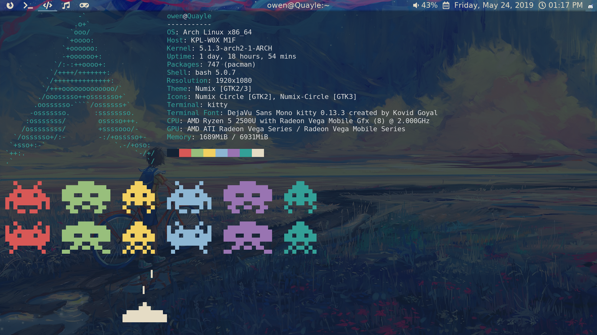

# i3lockr

Distort a screenshot and run `i3lock`.

## Important Notice

As of June 27 2019 and the new `master` (what used to be `v2`) branch, `i3lockr` requires an unreleased version of [i3lock](https://github.com/i3/i3lock).
In other words, build `i3lock` from the latest commit on GitHub.
See [i3/i3lock#231](https://github.com/i3/i3lock/issues/231) to find out if a new release of `i3lock` is out.

If you're on Arch Linux, you may use `i3lock-git` from the AUR.

## Quick start [[Documentation]](USAGE.md)

Signed binary releases are availible on the [releases page](https://github.com/owenthewizard/i3lockr/releases).  
Make sure to verify the signature and hashes!

Or build it yourself:
```bash
git clone --depth=1 git://github.com/owenthewizard/i3lockr.git && cd i3lockr
cargo build --release # you may adjust features here
sudo strip -s target/release/i3lockr -o /usr/local/bin/i3lockr
# shell completions are in target/ you may wish to copy them
i3lockr --blur 25 -- --nofork --ignore-empty-password # use your favorite args
```

## Screenshots

Without `--blur`


With `--blur=10`


With `--blur=25`


`i3lockr` (since v1.0.0) is incredibly fast at all blur levels, try timing it yourself with `time`.

### Coding Style

Obey `rustfmt` and Rust 2018 conventions, as well as `clippy` lints.

## Contributing

Pull requests are always welcome.

Unless you explicitly state otherwise, any contribution intentionally submitted for inclusion in the work by you, as defined in the Apache-2.0 license, shall be dual licensed under the terms of both the MIT License and the Apache License (Version 2.0).

## Versioning

This project adheres to [Semantic Versioning](https://semver.org/spec/v2.0.0.html).

Changes are documented in the [Changelog](CHANGELOG.md).

See the [tags](https://github.com/owenthewizard/i3lockr/tags) for available releases.

## Authors

See [the list of contributors](https://github.com/owenthewizard/i3lockr/contributors).

## License

See [LICENSE-APACHE](LICENSE-APACHE.md) and [LICENSE-MIT](LICENSE-MIT.md) for details.

## Acknowledgments

* [i3lock](https://github.com/i3/i3lock) by [Michael Stapelberg](https://github.com/stapelberg) and [contributors](https://github.com/i3/i3lock/graphs/contributors).
* [i3lock-fancy](https://github.com/meskarune/i3lock-fancy) by [Dolores Portalatin](https://github.com/meskarune) for inspiration.
* [Martin Dørum](https://github.com/mortie) for contributions to `i3lock` that made this possible.
