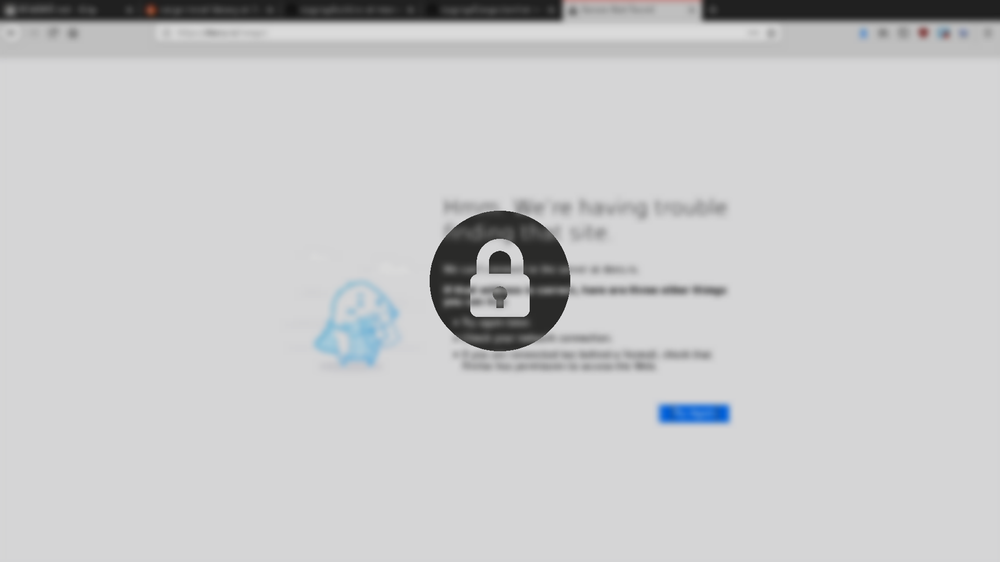

# i3lockr

Distort a screenshot and run `i3lock`.

## Quick Start [[Documentation]](USAGE.md)

Signed binary releases are availible [here](https://github.com/owenthewizard/i3lockr/releases).

```bash
git clone --depth=1 git://github.com/owenthewizard/i3lockr.git && cd i3lockr
cargo build --release
sudo strip -s target/release/i3lockr /usr/local/bin/i3lockr
i3lockr --invert -- --nofork --noempty # or your favorite args
```

## Screenshots

Without `--invert`


With `--invert`


With the default options on a 1080p monitor, `i3lockr` takes less than half a second to run!

## Important Notes

The exit status of `i3lockr` is not reliable!
That means that `i3lockr && systemctl suspend` may not lock the screen if there was an error.

### Coding Style

Obey `rustfmt` and Rust 2018 conventions.

## Contributing

Pull requests are always welcome. See [TODO](TODO.md).

## Versioning

This project adheres to [Semantic Versioning](https://semver.org/spec/v2.0.0.html).

Changes are documented in the [Changelog](CHANGELOG.md).

See the [tags on this repository](https://github.com/owenthewizard/i3lockr/tags) for available releases.

## Authors

See [the list of contributors](https://github.com/owenthewizard/i3lockr/contributors).

## License

`i3lockr` is primarily distributed under the terms of both the MIT license and the Apache License (Version 2.0).

See [LICENSE-APACHE](LICENSE-APACHE.md) and [LICENSE-MIT](LICENSE-MIT.md) for details.

## Acknowledgments

* [i3lock-fancy](https://github.com/meskarune/i3lock-fancy) by Dolores Portalatin for inspiration.
* [Padlock Icon](padlock.svg) made by [Chanut](https://www.flaticon.com/authors/chanut) from [Flaticon](https://www.flaticon.com) is licensed by [CC 3.0 BY](https://creativecommons.org/licenses/by/3.0/).
